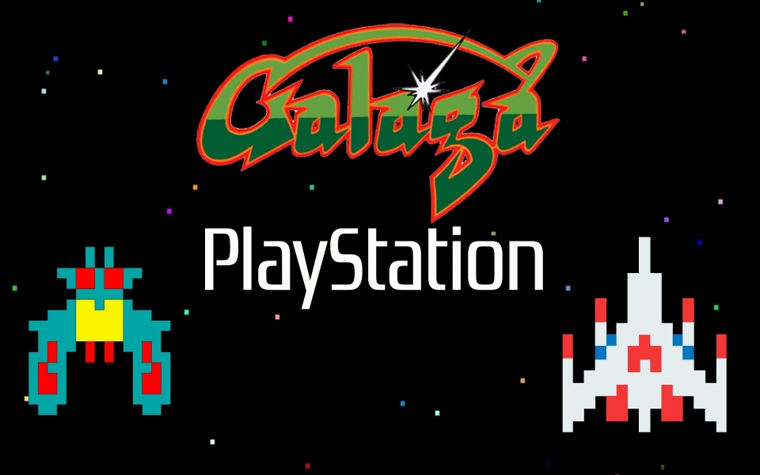

# Aline_Invasion

Creating the old Alien-Invasion game with Python-3.<br />
<p align="center">
  
</p>

## How it works ?
By using the python library <b><i>pygame</i></b>.

## How to setup ?
First install python-3 on your system. ( [from here](https://phoenixnap.com/kb/how-to-install-python-3-windows) )<br />
After that install python installing package ( pip ):
```shell
python -m pip install --upgrade pip setuptools wheel
```
After that install python pygame library:
```shell
pip install pygame
```
The run the project python file
```shell
python alien_invasion.py
```

#### Game demo
<p align="center">
  
  
</p>
